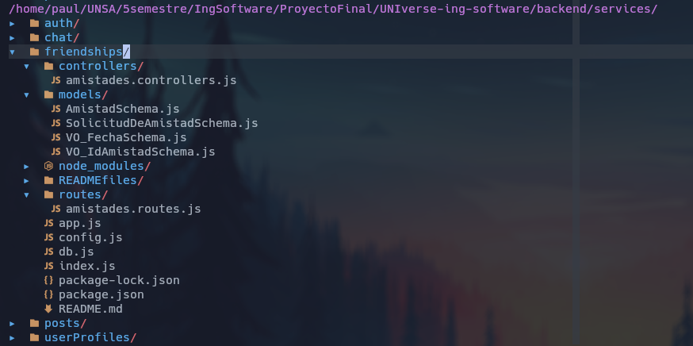

# Laboratorio 9: Estilos de Programacion
## 1. Estilo de Programación "Things" (The Kingdom of Nouns)

El estilo de programación "Things", también conocido como "The Kingdom of Nouns", es un enfoque orientado a objetos para organizar y estructurar el código. En este estilo, el problema se descompone en "cosas" (things) que tienen sentido dentro del dominio del problema. Cada "cosa" es una cápsula de datos que expone procedimientos para interactuar con el mundo exterior. La comunicación con los datos internos de una cosa siempre se realiza a través de estos procedimientos, nunca accediendo directamente a los datos.

Este enfoque promueve la encapsulación y la abstracción, lo que facilita el diseño modular y mantenible del software. Cada cosa representa un concepto en el dominio del problema y encapsula su estado y comportamiento, lo que permite cambios internos sin afectar el resto del sistema.

## Ejemplos de Clases relacionadas con el Estilo "Things"

### Clase: Amistad

Representa una relación de amistad entre dos usuarios.

```javascript
const AmistadSchema = new mongoose.Schema({
    id: {
        type: mongoose.Schema.Types.FriendId,
        required: true,
        trim: true,
    },
    usuario1: {
        type: mongoose.Schema.Types.ObjectId,
        ref: "Usuario",
        required: true,
        trim: true,
    },
    usuario2: {
        type: mongoose.Schema.Types.ObjectId,
        ref: "Usuario",
        required: true,
        trim: true,
    },
});
```

- Esta clase representa una "Amistad" como una cosa.
- Encapsula los datos relacionados con una amistad, como "id", "usuario1" y "usuario2".
- Expondría procedimientos para interactuar con los datos internos, como obtener los usuarios involucrados en la amistad.


### Clase: SolicitudDeAmistad

Representa una solicitud de amistad enviada de un usuario a otro.

```javascript
const SolicitudDeAmistadSchema = new mongoose.Schema({
    IDRemitente: {
        type: mongoose.Schema.Types.ObjectId,
        ref: "Usuario",
        required: true,
        trim: true,
    },
    IDDestinatario: {
        type: mongoose.Schema.Types.ObjectId,
        ref: "Usuario",
        required: true,
        trim: true,
    },
    EstadoDeSolicitud: {
        type: String,
        required: true,
        trim: true,
    },
});
```

- Esta clase representa una "Solicitud de Amistad" como una cosa.
- Encapsula los datos relacionados con una solicitud de amistad, como el "IDRemitente", "IDDestinatario" y "EstadoDeSolicitud".
- Expondría procedimientos para interactuar con los datos internos, como obtener el estado de la solicitud o los usuarios involucrados.

El estilo de programación "Things" se basa en la idea de dividir el problema en entidades que representan "cosas" en el dominio del problema. Cada cosa encapsula su propio estado y expone procedimientos para interactuar con ese estado. Este enfoque de diseño facilita la modularidad, la reutilización de código y la mantenibilidad del software, lo que lo convierte en una opción popular para desarrollar sistemas orientados a objetos.

## 2. Estilo de Programación "RESTful" 

El siguiente código muestra cómo configurar una aplicación web utilizando el marco de trabajo Express.js. Se explicará cómo este código se relaciona con el estilo de arquitectura RESTful y los principios que lo respaldan.


## Explicación y Relación con RESTful

1. **Creación de la aplicación web**: El código utiliza el módulo Express para crear la aplicación web `app`. Este es el punto de entrada principal para configurar y gestionar las rutas y controladores de la aplicación.
    
2. **Middlewares**: Los middlewares son funciones que se ejecutan antes de que se maneje una solicitud o después de que se genere una respuesta. En este caso, el código aplica tres middlewares:
    
    - `cors()`: Es un middleware que habilita la política de mismo origen y permite solicitudes de diferentes dominios. Esto es útil para permitir el acceso a los recursos de la API desde dominios externos.
        
    - `express.json()`: Es un middleware que analiza las solicitudes entrantes con carga útil JSON y convierte los datos en objetos JavaScript accesibles a través de `req.body`.
        
    - `fileUpload`: Este middleware se utiliza para permitir la carga de archivos en el servidor. Está configurado para almacenar los archivos temporales en un directorio llamado "upload".
        
3. **Rutas**: Se importa y utiliza el módulo de rutas `chatRoutes` para gestionar las rutas relacionadas con el chat. El enfoque aquí es organizar las rutas que se relacionan con recursos específicos (en este caso, operaciones de chat) en módulos separados, lo que sigue un enfoque RESTful de separación de recursos.
    
4. **Express Static**: Se utiliza el middleware `express.static` para servir archivos estáticos desde el directorio "client/build". Esto podría ser parte de la interfaz de usuario de la aplicación web, ya que generalmente los archivos estáticos contienen recursos como archivos CSS, JavaScript y archivos HTML.
    

- Las rutas están organizadas en módulos separados (separación de recursos).
- Se utilizan los middlewares adecuados para procesar las solicitudes entrantes y salientes.
- La aplicación está configurada para servir archivos estáticos (si es aplicable a la interfaz de usuario).

## Código:

```javascript
import express from "express";
import fileUpload from "express-fileupload";
import amistadesRoutes from "./routes/amistades.routes.js";
import { dirname, join } from "path";
import { fileURLToPath } from "url";
import cors from 'cors';

const app = express();
const __dirname = dirname(fileURLToPath(import.meta.url));

// middlewares
app.use(cors())
app.use(express.json());
app.use(
    fileUpload({
        useTempFiles: true,
        tempFileDir: "./upload",
    })
);

// routes
app.use(amistadesRoutes);
console.log(__dirname);
app.use(express.static(join(__dirname, "../client/build")));

export default app;
```


## 3. Estilo de Programación "Tantrum"

En el código, se podría aplica el concepto de diseño por contrato o "tantrum" de la siguiente manera:

1. **Verificación de los datos de entrada**: La validación de los datos de entrada (en este caso, el valor de `MONGODB_URI`), al aplicar el estilo de diseño por contrato, se debería verificar si `MONGODB_URI` contiene una cadena de conexión válida a la base de datos antes de intentar conectarse.
    
2. **Manejo de errores de conexión**: En el bloque `try...catch`, el código intenta conectarse a la base de datos utilizando `mongoose.connect(MONGODB_URI)`. Aquí, se podría agregar una verificación adicional para manejar posibles errores de conexión. Por ejemplo, podría comprobar si la conexión fue exitosa o si ocurrió algún error durante la conexión y manejar esos errores de manera adecuada, como arrojar una excepción o mensaje de error para indicar que algo no ha ido bien.
    

```javascript
import mongoose from "mongoose";
import { MONGODB_URI } from "./config.js";

export async function connectDB() {
  try {
    mongoose.set("strictQuery", true);
    const db = await mongoose.connect(MONGODB_URI);
    console.log(`Connected to database: ${db.connection.name}`);
  } catch (error) {
    console.log(error);
  }
}
```

Aplicar el estilo de diseño por contrato o "tantrum" en este código implicaría hacer explícitas todas las verificaciones necesarias para garantizar que los datos de entrada sean válidos y manejar los errores de conexión de manera adecuada. Esto mejoraría la confiabilidad del código y garantizaría un manejo adecuado de las situaciones en las que la conexión a la base de datos pueda fallar.

# Laboratorio 10: Código Limpio

## 1. Limit Line Length - Limitar la longitud de la línea
El principio de "Limit Line Length" o "Limitar la longitud de líneas" es una práctica recomendada en el desarrollo de software que sugiere mantener las líneas de código dentro de un límite específico de caracteres, generalmente entre 80 y 120 caracteres por línea. Este principio forma parte del concepto de "Código Limpio" y es ampliamente utilizado en la industria para mejorar la legibilidad y mantener la estructura del código.

Aquí hay algunas razones para seguir este principio:

1. **Legibilidad**: Líneas más cortas son más fáciles de leer y comprender rápidamente. Si las líneas son demasiado largas, los desarrolladores pueden tener dificultades para visualizar toda la línea en una sola vista, lo que puede dificultar la comprensión del flujo de código.
    
2. **Dificultad en la revisión**: Cuando se hacen revisiones de código, líneas muy largas pueden requerir un desplazamiento constante de izquierda a derecha para leer todo el contenido, lo que puede llevar a omitir detalles importantes.
    
3. **Evitar el scroll horizontal**: En muchos entornos de desarrollo, el scroll horizontal para visualizar líneas de código largas puede ser incómodo y poco práctico.
    
4. **Mantener la estructura del código**: Líneas más cortas ayudan a mantener la estructura general del código, lo que facilita la identificación de bloques de código y jerarquías.
    

Sin embargo, también es importante tener en cuenta que esta práctica no es una regla absoluta y puede haber situaciones en las que sea difícil cumplir con el límite de longitud de línea, especialmente en casos de cadenas de texto largas o expresiones complicadas. En esos casos, el enfoque principal debe ser la claridad y legibilidad del código. Si bien se debe intentar mantener líneas más cortas siempre que sea posible, no es necesario sacrificar la comprensión del código solo para cumplir con el límite.

La longitud de línea preferida puede variar según la comunidad de desarrollo, el lenguaje de programación y las convenciones del equipo. Al trabajar en un proyecto, es útil definir y seguir pautas de estilo de código compartidas, que pueden incluir la longitud máxima de línea y otros aspectos de formato para mantener una base de código coherente y fácil de leer.

```javascript
import express from "express";
import fileUpload from "express-fileupload";
import amistadesRoutes from "./routes/amistades.routes.js";
import { dirname, join } from "path";
import { fileURLToPath } from "url";
import cors from 'cors';

const app = express();
const __dirname = dirname(fileURLToPath(import.meta.url));

// middlewares
app.use(cors())
app.use(express.json());
app.use(
    fileUpload({
        useTempFiles: true,
        tempFileDir: "./upload",
    })
);

// routes
app.use(amistadesRoutes);
console.log(__dirname);
app.use(express.static(join(__dirname, "../client/build")));

export default app;
```
1. Los parámetros de los middlewares `cors()`, `express.json()` y `fileUpload()` se han colocado en una sola línea para asegurar que cada línea no exceda la longitud máxima.
    
2. Los métodos `app.use()` se han dispuesto uno por línea para facilitar la lectura y mantener una estructura clara en la aplicación.
    
3. El objeto de configuración de `fileUpload()` se ha colocado en una sola línea, asegurando que la línea no exceda el límite de caracteres.
    

Con estas modificaciones, el código cumple con el principio de "Limit Line Length", lo que resulta en un código más legible y fácil de mantener.

## 2. File and Folder Organization - Organización de archivos y carpetas

Una buena organización de archivos y carpetas es esencial para mantener un código limpio y fácil de mantener. Algunos de los principios y prácticas asociadas con la organización de archivos y carpetas incluyen:

1. **Jerarquía lógica**: Los archivos y carpetas deben organizarse en una jerarquía lógica y significativa. Esto significa agrupar archivos relacionados en carpetas y organizar esas carpetas en una estructura coherente que refleje la arquitectura y la lógica del proyecto.
    
2. **Nombres descriptivos**: Utilizar nombres descriptivos para las carpetas y los archivos. Los nombres deben ser claros y reflejar el contenido o el propósito del archivo o carpeta.
    
3. **Evitar carpetas planas**: Evitar tener todas las clases o archivos en una sola carpeta, ya que esto puede dificultar la búsqueda y comprensión del código. En su lugar, agrupar archivos relacionados en carpetas para una mayor organización.
    
4. **Separación de intereses**: Mantener archivos y carpetas separados por responsabilidades o intereses. Por ejemplo, separar las capas de presentación, lógica de negocio y acceso a datos en carpetas distintas.
    
5. **Archivos de configuración**: Mantener los archivos de configuración, como los archivos de propiedades, en una ubicación específica y fácilmente accesible.
    
6. **Carpeta para pruebas**: Tener una carpeta específica para almacenar pruebas (tests) unitarias y de integración.
    
7. **Carpetas para recursos**: Si el proyecto incluye recursos como imágenes, archivos CSS, etc., tener carpetas específicas para almacenar estos recursos.
    
8. **Evitar carpetas vacías o innecesarias**: Evitar crear carpetas que no tengan contenido o que no aporten valor organizativo al proyecto.
    

Una buena organización de archivos y carpetas facilita el mantenimiento del código, mejora la colaboración entre los miembros del equipo y hace que el proyecto sea más escalable y sostenible a medida que crece.

Es importante tener en cuenta que no existe una estructura única y correcta para la organización de archivos y carpetas, ya que puede variar según el tipo de proyecto y las preferencias del equipo. Lo más importante es seguir una estructura coherente y significativa que facilite el desarrollo y la comprensión del código por parte de todos los involucrados.



## 3. Object-Oriented vs. Procedural
### Paradigma Procedural

En la programación procedimental, el enfoque se basa en la creación de funciones o procedimientos que realizan tareas específicas. Estas funciones pueden tener acceso a variables globales y pueden modificarlas directamente. El código procedimental tiende a ser más lineal y secuencial, con una serie de pasos ordenados para lograr un objetivo.

Ventajas del Paradigma Procedural:

- Es más fácil de aprender y comprender para programadores principiantes.
- Es adecuado para problemas pequeños o sencillos, ya que puede ser más simple y directo.

Desventajas del Paradigma Procedural:

- Puede volverse rápidamente caótico y difícil de mantener a medida que el proyecto crece en complejidad.
- La falta de encapsulación puede llevar a problemas de mantenimiento y depuración.
- No es tan adecuado para proyectos más grandes y complejos, donde la modularidad y la reutilización son esenciales.

```javascript
/**
 * Acepta una solicitud de amistad.
 * @function aceptarSolicitudDeAmistad
 * @param {Object} req - Objeto de solicitud de Express.
 * @param {Object} res - Objeto de respuesta de Express.
 * @returns {Promise<void>} - No devuelve ningún valor explícito.
 * @throws {Error} - Si ocurre algún error en el servidor o si la solicitud de amistad no se encuentra o no está pendiente.
 */
export const aceptarSolicitudDeAmistad = (req, res) => {
    const { id } = req.params;
    SolicitudDeAmistad.findById(id)
        .then(friendRequest => {
            if (!friendRequest || friendRequest.EstadoDeSolicitud !== "Pendiente") {
                return res.status(404).json({ message: "Solicitud de amistad no encontrada o no está pendiente" });
            }
            friendRequest.EstadoDeSolicitud = "Aceptada";
            return friendRequest.save();
        })
        .then(() => {
            res.json({ message: "Solicitud de amistad aceptada exitosamente" });
        })
        .catch(error => {
            console.log(error.message);
            res.status(500).json({ message: error.message });
        });
};

```

### Paradigma Orientado a Objetos

En la programación orientada a objetos (POO), el enfoque se basa en la creación de objetos, que son instancias de clases que encapsulan datos (atributos) y comportamiento (métodos) relacionados. Los objetos interactúan entre sí a través de mensajes, lo que permite una mayor modularidad y reutilización de código. La POO se basa en los conceptos de encapsulación, herencia y polimorfismo.

Ventajas del Paradigma Orientado a Objetos:

- Proporciona una mayor modularidad y reutilización de código, lo que facilita el mantenimiento y la extensibilidad.
- Mejora la organización del código al agrupar atributos y métodos relacionados en objetos.
- Permite la abstracción, lo que facilita el diseño y la comprensión del software.

Desventajas del Paradigma Orientado a Objetos:

- Puede tener una curva de aprendizaje más pronunciada, especialmente para programadores nuevos en la POO.
- Puede haber una sobrecarga de complejidad si el diseño no se realiza adecuadamente.

```javascript
const AmistadSchema = new mongoose.Schema({
    id: {
        type: mongoose.Schema.Types.FriendId,
        required: true,
        trim: true,
    },
    usario1: {
        type: mongoose.Schema.Types.ObjectId,
        ref: "Usuario",
        required: true,
        trim: true,
    },
    usuario2: {
        type: mongoose.Schema.Types.ObjectId,
        ref: "Usuario",
        required: true,
        trim: true,
    },
});
```


### Relación con Código Limpio

El "código limpio" no se inclina específicamente hacia uno de estos paradigmas, ya que ambos pueden aplicar principios de código limpio. Sin embargo, la POO suele fomentar una estructura más organizada y modular, lo que encaja bien con los principios de código limpio, como la responsabilidad única, la cohesión y el acoplamiento bajo. La POO también favorece la encapsulación y la ocultación de información, lo que puede conducir a un código más limpio y menos propenso a errores.

En última instancia, el paradigma a elegir depende del problema específico a resolver, el equipo de desarrollo, la escala del proyecto y otros factores. En algunos casos, un enfoque procedimental puede ser más adecuado, mientras que en otros, la POO puede ofrecer una mayor ventaja en términos de mantenibilidad y extensibilidad del código. Lo más importante es aplicar principios de código limpio y mantener una estructura organizada y comprensible, sin importar qué paradigma se elija.


## 4. Consistent Indentation - Identacion consistente

El uso de indentación consistente es esencial para mejorar la legibilidad y la comprensión del código. Algunas de las prácticas asociadas con la "Consistent Indentation" incluyen:

1. **Elección de Espacios o Tabulaciones**: Es importante elegir una convención para el uso de espacios o tabulaciones en el código y adherirse a ella en todo el proyecto. La elección entre espacios o tabulaciones es una preferencia personal o de equipo, pero lo más importante es mantener la consistencia en todo el código.
    
2. **Cantidad de Espacios o Tabulaciones**: Determinar la cantidad de espacios o tabulaciones que se utilizarán para cada nivel de indentación. La mayoría de los lenguajes de programación tienen convenciones bien establecidas para esto. Por ejemplo, muchos proyectos de JavaScript utilizan 2 espacios para cada nivel de indentación.
    
3. **Alinear Bloques de Código**: Los bloques de código, como las estructuras condicionales (if/else, switch) y bucles (for, while), deben estar alineados correctamente para resaltar la estructura del código.
    
4. **Separar Niveles de Anidación**: Cada nivel de anidación debe estar claramente separado por la cantidad de espacios o tabulaciones adecuadas. Esto evita confusiones y facilita la identificación de bloques de código anidados.
    
5. **Mantener Longitud de Línea**: Al aplicar la indentación, asegurarse de que la longitud de línea no exceda el límite establecido, de acuerdo con el principio de "Limit Line Length". Esto contribuye a una mejor legibilidad del código.
    

Un código con indentación consistente es más fácil de leer, mantener y comprender, tanto para el autor original del código como para otros desarrolladores que puedan trabajar en el proyecto. Mantener una estructura de indentación clara y uniforme es una práctica esencial para seguir los principios de "código limpio" y facilitar la colaboración en el desarrollo de software.

```javascript
import mongoose from "mongoose";
import { MONGODB_URI } from "./config.js";

export async function connectDB() {
    try {
        mongoose.set("strictQuery", true);
        const db = await mongoose.connect(MONGODB_URI);
        console.log(`Connected to database: ${db.connection.name}`);
    }  
    catch (error) {
        console.log(error);
    }
}
```

## 5. Consistent Naming Scheme - Esquema de Nombres Consistente

Es un principio del "código limpio" que se enfoca en mantener una convención coherente al nombrar variables, funciones, clases, módulos y otros elementos en el código fuente. Una nomenclatura coherente y significativa mejora la legibilidad y la comprensión del código, lo que facilita la colaboración y el mantenimiento del software.

Algunas prácticas asociadas con el "Consistent Naming Scheme" incluyen:

1. **Elección de Nombres Descriptivos**: Utilizar nombres descriptivos y significativos que reflejen claramente la función, propósito o contenido del elemento al que se refieren. Los nombres deben ser autoexplicativos y evitar abreviaturas ambiguas.
    
2. **Convenciones de Capitalización**: Decidir una convención para la capitalización de los nombres, como camelCase, PascalCase o snake_case, y seguir esa convención en todo el código. Por ejemplo, camelCase es popular en JavaScript y Python, mientras que PascalCase es común en C# o Java.
    
3. **Nombres Coherentes para Conceptos Similares**: Si hay elementos relacionados o que representan conceptos similares, utilizar nombres que reflejen esa relación o similitud. Esto facilita la comprensión de cómo se relacionan entre sí.
    
4. **Evitar Nombres Ambiguos**: Evitar nombres que puedan dar lugar a ambigüedades o malentendidos sobre el propósito del elemento. Es importante que los nombres sean claros y sin doble interpretación.
    
5. **Nombrar Funciones y Métodos con Verbos**: Para funciones y métodos, utilizar verbos o frases verbales que describan la acción que realizan. Esto ayuda a entender rápidamente qué hace la función.
    
6. **Nombrar Clases con Sustantivos**: Para clases, utilizar nombres sustantivos que representen los objetos o conceptos que encapsulan.
    
7. **Consistencia en Todo el Proyecto**: Mantener la misma convención de nombres en todo el proyecto, independientemente de la parte del código o del equipo que lo escriba. Esto asegura una experiencia coherente para todos los desarrolladores.
    

Un "Consistent Naming Scheme" es fundamental para mantener un código limpio y fácil de entender. Los nombres consistentes ayudan a reducir la ambigüedad, facilitan la navegación por el código y permiten que nuevos miembros del equipo se incorporen con mayor facilidad. Siguiendo una nomenclatura coherente, el código se vuelve más legible, mantenible y escalable, lo que a su vez mejora la calidad y la eficiencia del desarrollo de software.
```javascript
import mongoose from "mongoose";

const SolicitudDeAmistadSchema = new mongoose.Schema({
    IDRemitente: {
        type: mongoose.Schema.Types.ObjectId,
        ref: "Usuario",
        required: true,
        trim: true,
    },
    IDDestinatario: {
        type: mongoose.Schema.Types.ObjectId,
        ref: "Usuario",
        required: true,
        trim: true,
    },
    EstadoDeSolicitud: {
        type: String,
        required: true,
        trim: true,
    },
});
const SolicitudDeAmistad = mongoose.model("SolicitudDeAmistad", SolicitudDeAmistadSchema);
export default SolicitudDeAmistad;
```

```javascript
/**
 * Envia una solicitud de amistad.
 * @function enviarSolicitudDeAmistad
 * @param {Object} req - Objeto de solicitud de Express.
 * @param {Object} res - Objeto de respuesta de Express.
 * @returns {Promise<void>} - No devuelve ningún valor explícito.
 * @throws {Error} - Si ocurre algún error en el servidor.
 */
export const enviarSolicitudDeAmistad = (req, res) => {
    const { idRemitente, idDestinatario } = req.body;
    SolicitudDeAmistad.findOne({
        IdRemitente: idRemitente,
        IdDestinatario: idDestinatario,
    })
        .then(existingRequest => {
            if (existingRequest) {
                return res.status(400).json({ message: "Ya se ha enviado una solicitud de amistad" });
            }

            const newFriendRequest = new SolicitudDeAmistad({
                IdRemitente: idRemitente,
                IdDestinatario: idDestinatario,
                EstadoDeSolicitud: "Pendiente",
            });

            return newFriendRequest.save();
        })
        .then(newFriendRequest => {
            res.status(201).json(newFriendRequest);
        })
        .catch(error => {
            console.log(error.message);
            res.status(500).json({ message: error.message });
        });
};
```

# Laboratorio 11: Principios SOLID
## 1. S: Single Responsibility Principle (SRP)

El Principio de Responsabilidad Única (Single Responsibility Principle - SRP) es uno de los pilares fundamentales de los principios SOLID en ingeniería de software. Este principio se centra en asegurar que cada clase o módulo tenga una única responsabilidad o tarea específica.

La idea detrás del SRP es que una clase debe ser responsable de una única funcionalidad o característica dentro del sistema. Si una clase tiene múltiples responsabilidades, esto puede llevar a un código confuso, difícil de mantener y propenso a errores. Por lo tanto, es recomendable dividir esas responsabilidades en diferentes clases, cada una de ellas encargada de una tarea específica.

Beneficios del SRP:

1. **Mantenibilidad:** Al tener clases con responsabilidades únicas, el código se vuelve más fácil de entender y modificar. Si una clase necesita cambios, se puede enfocar únicamente en la lógica relacionada a su responsabilidad, sin afectar otras partes del sistema.
    
2. **Reutilización:** Al separar las responsabilidades, los componentes se vuelven más modulares, lo que facilita la reutilización en otros lugares del sistema o en proyectos futuros.
    
3. **Testabilidad:** Las clases con responsabilidades únicas tienden a ser más fáciles de probar, ya que sus funcionalidades están bien delimitadas y se pueden crear pruebas más específicas para cada una de ellas.
    
4. **Claridad y comprensión:** Un diseño basado en el SRP mejora la legibilidad del código, ya que cada clase tiene un propósito claro y bien definido, lo que facilita a otros desarrolladores entender rápidamente su función y responsabilidad.
    

Sin embargo, es importante tener en cuenta que aplicar el SRP no significa crear una gran cantidad de clases extremadamente pequeñas para cada tarea trivial. Debe haber un equilibrio y sentido común en el diseño. El objetivo es dividir las responsabilidades de forma lógica y coherente, agrupando funcionalidades relacionadas y evitando la mezcla de tareas inconexas.

Un enfoque útil para identificar si una clase viola el SRP es utilizar la técnica de "la prueba del cambio". Si una modificación en un requisito o funcionalidad requiere cambios en múltiples lugares dentro de la misma clase, es probable que esa clase tenga más de una responsabilidad y deba dividirse en clases más pequeñas y cohesivas.

### SolicitudDeAmistadSchema.js

```javascript
import mongoose from "mongoose";

const SolicitudDeAmistadSchema = new mongoose.Schema({
    IDRemitente: {
        type: mongoose.Schema.Types.ObjectId,
        ref: "Usuario",
        required: true,
        trim: true,
    },
    IDDestinatario: {
        type: mongoose.Schema.Types.ObjectId,
        ref: "Usuario",
        required: true,
        trim: true,
    },
    EstadoDeSolicitud: {
        type: String,
        required: true,
        trim: true,
    },
});
const SolicitudDeAmistad = mongoose.model("SolicitudDeAmistad", SolicitudDeAmistadSchema);
export default SolicitudDeAmistad;
```

### Amistades.Controller.js
```javascript
import SolicitudDeAmistad from "../models/SolicitudDeAmistadSchema.js";

/**
 * Envia una solicitud de amistad.
 * @function enviarSolicitudDeAmistad
 * @param {Object} req - Objeto de solicitud de Express.
 * @param {Object} res - Objeto de respuesta de Express.
 * @returns {Promise<void>} - No devuelve ningún valor explícito.
 * @throws {Error} - Si ocurre algún error en el servidor.
 */
export const enviarSolicitudDeAmistad = (req, res) => {
    const { idRemitente, idDestinatario } = req.body;
    SolicitudDeAmistad.findOne({
        IdRemitente: idRemitente,
        IdDestinatario: idDestinatario,
    })
        .then(existingRequest => {
            if (existingRequest) {
                return res.status(400).json({ message: "Ya se ha enviado una solicitud de amistad" });
            }

            const newFriendRequest = new SolicitudDeAmistad({
                IdRemitente: idRemitente,
                IdDestinatario: idDestinatario,
                EstadoDeSolicitud: "Pendiente",
            });

            return newFriendRequest.save();
        })
        .then(newFriendRequest => {
            res.status(201).json(newFriendRequest);
        })
        .catch(error => {
            console.log(error.message);
            res.status(500).json({ message: error.message });
        });
};

/**
 * Acepta una solicitud de amistad.
 * @function aceptarSolicitudDeAmistad
 * @param {Object} req - Objeto de solicitud de Express.
 * @param {Object} res - Objeto de respuesta de Express.
 * @returns {Promise<void>} - No devuelve ningún valor explícito.
 * @throws {Error} - Si ocurre algún error en el servidor o si la solicitud de amistad no se encuentra o no está pendiente.
 */
export const aceptarSolicitudDeAmistad = (req, res) => {
    const { id } = req.params;
    SolicitudDeAmistad.findById(id)
        .then(friendRequest => {
            if (!friendRequest || friendRequest.EstadoDeSolicitud !== "Pendiente") {
                return res.status(404).json({ message: "Solicitud de amistad no encontrada o no está pendiente" });
            }
            friendRequest.EstadoDeSolicitud = "Aceptada";
            return friendRequest.save();
        })
        .then(() => {
            res.json({ message: "Solicitud de amistad aceptada exitosamente" });
        })
        .catch(error => {
            console.log(error.message);
            res.status(500).json({ message: error.message });
        });
};

/**
 * Rechaza una solicitud de amistad.
 * @function rechazarSolicitudDeAmistad
 * @param {Object} req - Objeto de solicitud de Express.
 * @param {Object} res - Objeto de respuesta de Express.
 * @returns {Promise<void>} - No devuelve ningún valor explícito.
 * @throws {Error} - Si ocurre algún error en el servidor o si la solicitud de amistad no se encuentra o no está pendiente.
 */
export const rechazarSolicitudDeAmistad = (req, res) => {
    const { id } = req.params;
    SolicitudDeAmistad.findById(id)
        .then(friendRequest => {
            if (!friendRequest || friendRequest.EstadoDeSolicitud !== "Pendiente") {
                return res.status(404).json({ message: "Solicitud de amistad no encontrada o no está pendiente" });
            }
            friendRequest.EstadoDeSolicitud = "Rechazada";
            return friendRequest.save();
        })
        .then(() => {
            res.json({ message: "Solicitud de amistad rechazada exitosamente" });
        })
        .catch(error => {
            console.log(error.message);
            res.status(500).json({ message: error.message });
        });
};

```

En este caso, tenemos dos archivos: uno contiene las funciones que envían, aceptan y rechazan solicitudes de amistad, mientras que el otro define el esquema y el modelo de datos para las solicitudes de amistad. Veamos si cada archivo cumple con el SRP:

1. **Archivo `AmistadesController.js`:** Este archivo contiene tres funciones relacionadas con la gestión de solicitudes de amistad: `enviarSolicitudDeAmistad`, `aceptarSolicitudDeAmistad` y `rechazarSolicitudDeAmistad`. Cada función tiene una responsabilidad única, que es manejar la lógica específica para enviar, aceptar o rechazar una solicitud de amistad. Por lo tanto, este archivo parece cumplir con el principio de Responsabilidad Única, ya que cada función se centra en una tarea específica.
    
2. **Archivo `SolicitudDeAmistadSchema.js`:** Este archivo define el esquema y el modelo de datos para las solicitudes de amistad utilizando Mongoose. Su responsabilidad es establecer cómo se estructura y almacena la información de las solicitudes de amistad en la base de datos. Dado que su única responsabilidad es definir la estructura del esquema y el modelo, este archivo también parece cumplir con el principio de Responsabilidad Única.
    

En resumen, ambos archivos parecen cumplir con el principio de Responsabilidad Única, ya que cada uno tiene una responsabilidad única y claramente definida. El archivo `AmistadesController.js` se encarga de la lógica para enviar, aceptar y rechazar solicitudes de amistad, mientras que el archivo `SolicitudDeAmistadSchema.js` se encarga de definir la estructura del esquema y el modelo de datos para las solicitudes de amistad. Mantener las responsabilidades separadas facilita el mantenimiento y la comprensión del código.


## 2. D: Dependency Inversion Principle (DIP)

El principio de Inversión de Dependencia establece que los módulos de alto nivel no deben depender de módulos de bajo nivel, sino que ambos deben depender de abstracciones. Además, las abstracciones no deben depender de detalles, sino que los detalles deben depender de abstracciones.

```javascript
import dotenv from 'dotenv'

dotenv.config();

export const MONGODB_URI = process.env.MONGODB_URI || "mongodb://localhost/testdb";
export const PORT = process.env.PORT || 4000;
```

```javascript
import mongoose from "mongoose";
import { MONGODB_URI } from "./config.js";

export async function connectDB() {
    try {
        mongoose.set("strictQuery", true);
        const db = await mongoose.connect(MONGODB_URI);
        console.log(`Connected to database: ${db.connection.name}`);
    }  
    catch (error) {
        console.log(error);
    }
}
```

En el código, podemos identificar los siguientes puntos relacionados con DIP:

1. Abstracción de la base de datos: La función connectDB no se enfoca en los detalles específicos de la implementación de la base de datos MongoDB. En cambio, utiliza la abstracción proporcionada por la biblioteca Mongoose para establecer la conexión. De esta manera, el código no está directamente acoplado a los detalles de cómo se implementa la conexión, lo que facilita el cambio de la base de datos en el futuro si fuera necesario.

2. Utilización de una constante de configuración: La cadena de conexión a la base de datos, MONGODB_URI, se obtiene desde un módulo de configuración externo, llamado config.js. Al hacer esto, el código no está directamente acoplado a la cadena de conexión, lo que facilita el cambio de la configuración de la base de datos sin tener que modificar la función connectDB en sí misma.

Al utilizar abstracciones y depender de interfaces en lugar de detalles concretos, este código sigue el principio de Inversión de Dependencia, lo que lo hace más flexible y mantenible en el futuro, ya que los cambios en la implementación o configuración de la base de datos pueden realizarse sin afectar la lógica de la función connectDB.
